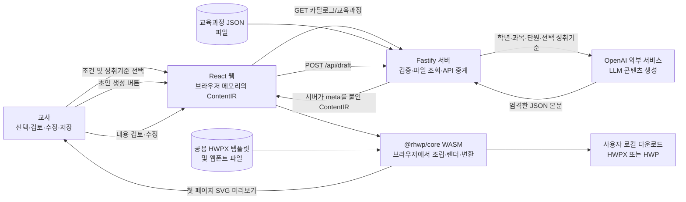

# Worksheet Generator 프로젝트 개요

> 검토 기준일: 2026-07-22  
> 프로젝트명: `worksheet_generator`  
> 판단 기준: **현재 작업 트리의 실행 코드·테스트·로컬 데이터**를 우선하고, 과거 설계/작업 보고서는 의도 확인에만 사용했다. 확인되지 않은 운영 사실은 `확인 필요`로 표시했다.

## 1. 5분 요약

| 항목 | 현재 확인된 내용 |
|---|---|
| 해결하려는 업무 | 교사가 교육과정 성취기준에 맞춘 **핵심 내용 정리 학습자료**를 손으로 처음부터 작성하는 시간을 줄인다. |
| 주요 사용자 | 직접 사용자: 초·중등 교사. 교육과정 JSON과 템플릿을 관리할 운영 담당자는 필요하지만 담당 조직·검수 절차는 **확인 필요**다. |
| 시작 조건 | 교육과정 JSON·공용 HWPX 템플릿이 배치되고 서버/웹이 실행된 상태에서 사용자가 웹을 연다. AI 생성에는 서버의 `OPENAI_API_KEY` 설정이 추가로 필요하다. |
| 종료 조건 | 시스템 기준으로는 사용자가 편집본을 HWPX 또는 HWP로 다운로드하면 끝난다. 서버 저장, 완료 상태, 정식 승인 기록은 없다. 업무상 최종 승인 기준은 **확인 필요**다. |
| 현재 결과물 | 제목, 학습목표, 핵심용어(최대 6개), 핵심내용을 담은 공용 예시 양식의 `.hwpx` 또는 `.hwp` 파일. 브라우저에는 1페이지만 SVG로 미리 보인다. |
| 데이터 범위 | 로컬 데이터 기준 10개 학기·과목 조합: 초등 국어 4-1, 초등 과학 3·4학년 각 1·2학기, 초등 사회 3·4학년 각 1·2학기, 중등 국어 1-1. 고등은 데이터가 없다. |
| 자동화 수준 | 선택과 최종 검토·저장은 사람 주도, 데이터 로드·LLM 호출·형식 검증·미리보기·문서 변환은 자동이다. 파일 업로드나 일정 실행은 없다. |
| 저장 구조 | 교육과정은 파일, 생성 중 콘텐츠는 React 메모리, 최종 문서는 사용자 브라우저 다운로드 영역에 저장된다. **데이터베이스는 사용하지 않는다.** |
| 검증 결과 | `npm test`: 12개 파일/130개 테스트 통과, 웹 빌드 통과, 서버·웹 TypeScript 검사 통과, 로컬 데이터 10개 조합 모두 스키마 로드 통과. |
| 현재 성숙도 | 로컬 기능 프로토타입은 작동한다. 실 OpenAI 호출, 실제 브라우저 전체 흐름, 한컴오피스 호환성, 운영 보안은 **확인 필요**이므로 공개 배포 준비 완료 상태는 아니다. |

## 2. 전체 구조와 역할 경계



- **사용자**는 사용할 교육과정과 성취기준을 정하고, LLM 결과의 교육적 타당성을 검토·수정하며, 저장 형식을 선택한다.
- **일반 코드**는 파일 조회, 스키마 검증, API 제한, 메타데이터 확정, 상태 관리, 템플릿 치환, 날짜/파일명 생성, SVG 렌더링과 HWPX/HWP 직렬화를 담당한다.
- **LLM**은 성취기준을 근거로 제목·학습목표·핵심용어·핵심내용을 생성한다. 교육과정 선택, 메타데이터, 파일 구조와 서식은 결정하지 않는다.
- **외부 서비스**는 OpenAI뿐이다. `@rhwp/core`는 빌드에 포함되어 브라우저에서 실행되는 일반 코드이며 문서를 외부 서버로 보내지 않는다.

## 3. 업무 범위

### 현재 다루는 범위

- 정적 교육과정 JSON을 학교급·학년·학기·과목·단원별로 조회하고 성취기준을 표시한다.
- 한 단원의 성취기준 1~20개를 사용자가 선택한다.
- 선택값을 OpenAI에 보내 구조화된 학습자료 초안을 생성한다.
- 제목, 학습목표, 핵심용어/뜻, 핵심내용 소제목/본문을 추가·삭제·순서 변경·수정한다.
- 편집할 때 300ms 디바운스로 공용 HWPX 템플릿의 첫 페이지를 다시 미리 본다.
- 브라우저에서 HWPX 또는 HWP를 생성해 다운로드한다.

### 현재 다루지 않는 범위

- 원본 Excel/HWP를 교육과정 JSON으로 바꾸는 가져오기·매핑·검수 자동화
- 사용자 계정, 인증/권한, 학생 개인정보, 데이터베이스, 서버 저장, 버전/이력, 결재 상태
- 사용자 템플릿/자료 파일 업로드, 배치·일정 실행, 이메일/메신저 배포
- 여러 사람의 협업 편집, 항목 단위 재생성, 자동 저장, 변경 취소/복구
- 이미지·수식·복잡 표 생성, 평가문항 생성, 인쇄·배포 관리
- 고등학교 교육과정 데이터, 과목별 정식 출력 양식, 전체 페이지 미리보기
- LLM 결과의 사실성·교육 적합성·성취기준 충족 여부에 대한 의미 기반 자동 검증

## 4. 현재 데이터 지원 범위

| 학교급 | 과목/학기 | 상태 | 출력 양식 |
|---|---|---|---|
| 초등 | 국어 4학년 1학기 | 데이터 로드 확인 | 공용 예시 양식 |
| 초등 | 과학 3·4학년 각 1·2학기 | 데이터 로드 확인 | 공용 예시 양식 |
| 초등 | 사회 3·4학년 각 1·2학기 | 데이터 로드 확인 | 공용 예시 양식 |
| 중등 | 국어 1학년 1학기 | 데이터 로드 확인 | 공용 예시 양식 |
| 고등 | 없음 | UI에 `준비 중`으로 표시 | 사용 불가 |

교육과정 JSON에는 출처 메타데이터와 원본 파일이 있으나, 원본→JSON 변환 코드와 업무 검수 기록은 없다. 또한 런타임 필수인 `data/` 전체가 `.gitignore` 대상이므로 새 배포본에 데이터를 어떤 방식으로 포함할지 **확인 필요**다.

## 5. 처음부터 끝까지의 업무 워크플로우

입력 출처 표기: **사용자 / 이전 단계 / 파일 / 외부 API**. 현재 어느 단계도 데이터베이스를 사용하지 않는다.

| 단계 | 시작 조건·자동화 | 수행 주체 | 주요 입력값과 출처 | 코드/LLM 처리 | 출력, 저장 위치 → 다음 사용 |
|---|---|---|---|---|---|
| 0. 교육과정 선행 준비 | 운영자가 원본을 확보할 때; **수작업** | 사용자(담당자 확인 필요) | 원본 Excel/HWP **[파일]** | 변환 코드 없음. JSON 작성 방식·검수자는 **확인 필요** | `data/<학교급>/curriculum/*.json` **[파일]** → 1단계 |
| 1. 앱 초기화 | 브라우저 페이지 열기; **완전 자동화** | 일반 코드 | 페이지 열기 **[사용자]**, 교육과정 JSON **[파일]** | `GET /api/curricula`, Zod 검증, 학기·과목 카탈로그 정렬; 첫 사용 가능 항목 선택 | 카탈로그와 선택값 **[브라우저 메모리]** → 2단계 |
| 2. 자료 범위 선택 | 학교급/학년/학기/과목/단원 변경; **일부 자동화** | 사용자 + 일반 코드 | 선택값 **[사용자]**, 카탈로그 **[이전 단계]**, JSON **[파일]** | `GET /api/curriculum/...`; 단원·하위단원으로 그룹화하고 중복 성취기준 제거 | 단원과 성취기준, 기본 전체 선택 상태 **[브라우저 메모리]** → 3단계 |
| 3. 성취기준 확정·초안 생성 | 1개 이상 선택 후 `✨ 초안 생성` 클릭; **일부 자동화** | 사용자 + 일반 코드 + LLM/외부 서비스 | 학년·과목·단원·선택 성취기준 **[이전 단계]**, 클릭 **[사용자]** | 서버 요청 검증·제한 → OpenAI 호출 → JSON/스키마 검증 → 요청값 기반 `meta` 조립 | `ContentIR` **[API 응답→브라우저 메모리]** → 4·5단계 |
| 4. 교사 검토·수정 | 초안 수신 후; **수작업** | 사용자 | LLM 초안 **[이전 단계/외부 API]**, 교사 판단 **[사용자]** | 입력 변경을 React 상태에 반영; 빈 값·최대 6개 용어는 저장 시 Zod 검증 | 편집된 `ContentIR` **[브라우저 메모리만]** → 5·6단계 |
| 5. HWP 미리보기 | 초안 생성 및 이후 편집마다 300ms 후; **완전 자동화** | 일반 코드 | 편집 IR **[이전 단계]**, 템플릿·폰트 **[파일]** | WASM 초기화, 토큰 치환, 문단 reflow, `renderPageSvg(0)` | 첫 페이지 SVG **[브라우저 DOM]** → 사용자 검토/4단계 반복 |
| 6. 저장·종료 | `HWPX로 저장` 또는 `HWP로 저장` 클릭; **일부 자동화** | 사용자 + 일반 코드 | 형식 **[사용자]**, 편집 IR **[이전 단계]**, 템플릿 **[파일]**, 브라우저 로컬 날짜 | 저장 전 구조 검증, 토큰 치환, reflow, `exportHwpx`/`exportHwp`, 파일명 금지문자 치환, WASM 메모리 해제 | `{과목}_{단원}_{제목}.hwpx|hwp` **[사용자 다운로드 영역]** → 시스템 흐름 종료 |

자동화는 페이지 열기, 선택 변경, 생성 버튼, 편집 후 타이머, 저장 버튼으로만 시작된다. 파일 업로드·스케줄러·cron·백그라운드 배치는 없다.

### 사용자의 입력·검토·승인 지점

1. 교육과정·단원·성취기준을 직접 선택한다. 선택이나 단원을 바꾸면 기존 초안은 즉시 사라진다.
2. LLM 초안의 사실성, 성취기준 반영, 학생 수준, 표현과 누락을 교사가 직접 검토·수정해야 한다. 코드는 이를 의미적으로 판정하지 않는다.
3. 빈 필수 항목과 핵심용어 6개 초과만 저장 직전에 차단한다.
4. 저장 클릭이 사실상 최종 승인 역할을 하지만 승인 버튼·체크리스트·승인자·감사 로그는 없다.
5. 새 초안 생성, 범위 변경, 새로고침 전에 미저장 변경 경고나 복구 기능이 없어 내용 손실 가능성이 있다.

## 6. 코드와 LLM의 명확한 분리

| 영역 | 일반 코드가 확정·실행 | LLM이 생성·판단 보조 |
|---|---|---|
| 근거 선택 | JSON에서 교육과정을 읽고 사용자가 고른 성취기준만 전달 | 전달받은 기준의 중요 내용을 해석 |
| 메타데이터 | 학년·과목·단원·성취기준 코드를 요청값으로 조립 | 생성하지 않음 |
| 콘텐츠 | 허용 필드, 필수값, 개수와 형식을 검증 | 제목, 학습목표, 핵심용어 선정/정의, 핵심내용 요약·재서술 생성 |
| 품질 판단 | JSON·Zod 구조만 검사 | 학생 어휘 수준과 내용 우선순위를 판단 보조 |
| 문서 | 날짜·파일명·토큰 치환·서식·SVG·HWPX/HWP 생성 | 파일이나 레이아웃을 만들지 않음 |
| 저장 | 브라우저 메모리와 로컬 다운로드만 사용 | 저장하지 않음 |

LLM 역할은 콘텐츠 생성·요약·재서술, 핵심용어 선정과 학생 수준 판단 보조다. 파일 추출, 독립적인 분류, 웹 검색은 하지 않으며 출처 인용, 근거 문장 연결, 사실 확인 기능도 없다.

## 7. LLM 입력, 프롬프트, 출력 계약

### 전달 데이터와 프롬프트 목적

- 모델은 코드에 `gpt-5.4-mini`로 고정되어 있고 OpenAI Chat Completions API를 사용한다.
- **시스템 프롬프트**: 학년 문자열 접두사로 초등학교/중학교/고등학교를 판별해 “교사를 돕는 학습자료 작성 전문가” 역할과 JSON 응답을 지시한다.
- **사용자 프롬프트**: 학년, 과목, 단원명, 선택한 성취기준의 코드와 원문을 전달한다.
- **생성 지침**: 핵심 내용 정리 초안을 만들고, 학생이 이해할 어휘로 재서술하며, 성취기준 문장을 그대로 복사하지 않고, 핵심용어를 중요도순 최대 6개로 제한한다.
- UI에는 개인정보 입력란이 없고 원본 파일 전체도 전송하지 않는다. 다만 공개 API 호출자는 문자열 필드에 임의 데이터를 넣을 수 있으므로 개인정보·프롬프트 주입 방지 정책은 **확인 필요**다.

### 기대 출력과 코드 처리

| 필드 | LLM 기대값 | 코드 처리 |
|---|---|---|
| `title` | 공백이 아닌 문자열 | 필수 검증, 편집·파일명·제목 토큰에 사용 |
| `learning_objectives` | 공백이 아닌 문자열 1개 이상 | 번호 목록으로 합쳐 템플릿에 삽입 |
| `key_terms` | `{term, definition}` 0~6개 | 고정 6행 표에 순서대로 삽입, 남은 행은 빈칸 |
| `summary` | `{heading, body}` 1개 이상 | 불릿과 줄바꿈으로 합쳐 한 슬롯에 삽입 |
| `meta` | LLM에 요청하지 않음 | 서버가 요청값으로 생성해 위변조/환각을 차단 |
| `table` | LLM 스키마에서 제외 | 편집 스키마에는 선택 필드가 있으나 UI·템플릿·저장에서는 미구현 |

OpenAI의 strict JSON Schema 형식을 요청한 뒤 `JSON.parse`와 Zod로 다시 검증한다. 빈 응답, 잘못된 JSON, 스키마 불일치는 같은 요청을 한 번 더 생성하고, 두 번째도 실패하면 전체 요청을 `502`로 끝낸다. 부분 결과 채움은 구현되어 있지 않다. 정상 응답도 웹에서 `ContentIRSchema`로 한 번 더 검증한다.

구조 검증만으로는 내용이 사실인지, 성취기준을 충분히 반영했는지, 저작권상 재서술이 충분한지 알 수 없다. 최종 교육 콘텐츠 검수는 사람 책임이며 현재 이를 강제하거나 기록하는 기능은 없다.

## 8. API와 주요 코드 지도

### API 경로

| 경로 | 역할 | 주요 응답/제한 |
|---|---|---|
| `GET /api/curricula` | 학교급·학년·학기·과목 카탈로그 | 파일/스키마 오류 시 `500` |
| `GET /api/subjects` | 기존 클라이언트용 데이터셋 키 목록 | deprecated지만 테스트상 동작; Makefile 준비 확인에도 사용 |
| `GET /api/curriculum/:schoolLevel/:datasetKey/:grade/:semester` | 단원과 성취기준 조회 | 없음/잘못된 키 `404`, 손상 데이터 `500` |
| `POST /api/draft` | OpenAI 초안 생성 | 본문 128KiB, IP별 분당 5회, 입력 오류 `400`, 키 미설정 `503`, 생성 실패 `502`, 초과 `429` |

### 폴더·파일·함수

| 위치 | 핵심 역할 |
|---|---|
| `shared/src/schema.ts` | 교육과정, 요청, LLM 생성 본문, 최종 `ContentIR`의 Zod 스키마와 길이/개수 제한 |
| `shared/src/template.ts` | 모든 교육과정이 가리키는 공용 예시 템플릿 경로 |
| `server/src/curriculum.ts` | `listCurricula`, `loadCurriculum`: JSON 검증, 카탈로그 생성, 단원 그룹화·중복 제거 |
| `server/src/app.ts` | Fastify 라우트, CORS, body limit, rate limit, 사용자용 오류와 안전한 실패 로그 |
| `server/src/openai.ts` | 런타임 프롬프트, strict 응답 스키마, `createOpenAiGenerateDraft`, 타임아웃·재시도·오류 분류 |
| `server/src/index.ts` | 루트 `.env` 로드, OpenAI 클라이언트 연결, 기본 포트 8787 서버 시작 |
| `data/<학교급>/curriculum/*.json` | 런타임 교육과정 파일. Git 비추적 상태이며 DB 대체 역할 |
| `data/<학교급>/raw/*` | 원본 Excel/HWP. 앱은 직접 읽지 않음 |
| `web/src/App.tsx` | 전체 선택→생성→편집→미리보기→저장 상태와 이벤트를 조율 |
| `web/src/api.ts` | 네 API 호출과 응답 스키마 재검증 |
| `web/src/components/*` | 학교급/교육과정 선택, 성취기준 체크, 구조화 편집기, 미리보기, 저장 버튼 |
| `web/src/hwp/fillLearningMaterial.ts` | `fillLearningMaterial`: 템플릿 토큰 치환, 로컬 날짜, 고정 6행 용어 표, 문단 reflow |
| `web/src/hwp/loadRhwp.ts`, `hwpDoc.ts` | WASM 1회 초기화/실패 후 재시도와 `HwpDocument` 어댑터 |
| `web/src/save.ts` | 저장 전 검증, 파일명 정리, HWPX/HWP 내보내기, 성공/실패 시 메모리 해제 |
| `web/public/templates/learning_material_prototype.hwpx` | 정식 디자인 확정 전 공용 예시 양식; 제목/학년/단원/날짜/목표/용어/요약 토큰 포함 |
| `web/public/fonts/*` | HWP 폰트명과 브라우저 측정/표시 폰트를 맞추는 한글 웹폰트 |
| `*/test/*`, `vitest*.ts` | 서버 라우트·UI·스키마·실제 WASM 내보내기/재열기 검증 |
| `Makefile`, `package*.json`, `tsconfig*.json`, `web/vite.config.ts` | 워크스페이스, 실행/종료, 빌드, 타입, 테스트, 개발 프록시 설정 |

`rhwp/`는 자체 `.git`을 가진 별도 로컬 참고 저장소이며 현재 프로젝트에서는 무시된다. 런타임은 npm 패키지 `@rhwp/core@0.7.17`을 사용한다. `docs/`, `.superpowers/`, 예시 README 작성 프롬프트와 컨설팅 HTML은 개발 참고 산출물이며 런타임 입력이 아니다. 과거 문서의 Anthropic/Claude 설명은 현재 OpenAI 코드로 대체되어 있다.

## 9. 설치·환경변수·실행

### 필요 조건

- Node.js, npm, `make`, POSIX shell, `curl`
- 정확한 지원 Node.js 버전은 `engines`나 버전 파일에 선언되어 있지 않아 **확인 필요**다. 이번 검증 환경은 Node `v26.3.0`, npm `11.16.0`이었다.
- 데이터 파일과 공용 템플릿. DB와 마이그레이션은 없다.

### 로컬 실행

```bash
npm ci
cp .env.example .env
# .env의 OPENAI_API_KEY 값을 안전하게 설정
make up
```

- 웹: `http://localhost:5173`
- API: `http://localhost:8787`
- 상태/로그/종료: `make status`, `make logs`, `make down`
- 별도 터미널 실행: `npm run dev:server`, `npm run dev:web`
- 키가 없으면 교육과정 선택·성취기준 조회는 가능하지만 `POST /api/draft`가 `503`이므로 콘텐츠 초안과 편집기는 사용할 수 없다.
- 서버는 `PORT`를 읽지만 Vite 개발 프록시는 8787로 고정되어 있다. 포트를 바꾸려면 프록시도 함께 바꿔야 한다.

### 검증·빌드

```bash
npm test
npx tsc --noEmit -p server/tsconfig.json
npx tsc --noEmit -p web/tsconfig.json
npm -w @wm/web run build
```

웹 빌드 산출물은 `web/dist/`에 생긴다. Fastify의 프로덕션 시작 스크립트, 정적 파일 서빙, 컨테이너/배포 설정, CI/CD는 현재 프로젝트에 없어 운영 실행 방식은 **확인 필요**다.

## 10. 기능 상태와 검증 수준

| 분류 | 기능 | 근거/남은 확인 |
|---|---|---|
| 정상 동작 확인 | 현재 로컬 교육과정 10개 조합 파싱·카탈로그·단원 조회 | 실제 데이터 전체를 로더로 검증 |
| 정상 동작 확인 | 요청/응답 스키마, API 상태코드, body/rate limit, 안전한 실패 로그 | Fastify inject 테스트 통과 |
| 정상 동작 확인 | 선택 UI, 성취기준 선택, 편집 항목 추가/삭제/정렬, 저장 전 검증 | jsdom UI 테스트 통과 |
| 정상 동작 확인 | 공용 템플릿 토큰 치환, reflow, HWPX/HWP 생성 후 재열기·SVG 렌더 | 실제 Node WASM 통합 테스트 통과 |
| 일부만 확인 | 실 OpenAI 생성 | 클라이언트 모의 테스트만 통과. 모델 접근 가능성, 품질·비용·지연은 **확인 필요** |
| 일부만 확인 | 브라우저 실제 WASM 미리보기·파일 다운로드 | 컴포넌트/Node WASM은 검증됨. 현재 연결 상태의 브라우저 E2E는 **확인 필요** |
| 일부만 동작 | 미리보기 | 첫 페이지만 표시; 긴 문서의 2페이지 이후 확인 불가 |
| 일부만 동작 | 출력 양식 | 모든 과목에 같은 공용 예시 양식 사용; 과목별 정식 디자인 아님 |
| 일부만 확인 | 한컴오피스 호환성 | rhwp 재열기는 통과. 대상 한컴 버전별 HWPX/HWP 육안 검수는 **확인 필요** |
| 동작하지 않음/미구현 | 고등학교, `ContentIR.table`, 인증·DB·이력·승인·업로드·스케줄·협업 | 데이터 또는 UI/서버 구현 없음 |

자동 검증에서 알려진 실패는 발견되지 않았다. 이는 실 LLM 응답의 교육적 품질이나 운영 환경의 적합성을 보장하지 않는다.

### 명시된 후속 기능과 범위 밖 기능

| 구분 | 항목 | 현재 상태 |
|---|---|---|
| 배포 전 필수로 명시 | 인증/접근 제어, 허용 CORS, 공유 rate-limit 저장소, 일일 호출/지출 상한 | 미구현 또는 단일 서버 수준만 구현 |
| 코드에 향후 구현으로 명시 | `ContentIR.table` 편집·템플릿 렌더링 | 스키마 필드만 있고 실제 결과에서는 무시 |
| 정식 디자인 전 상태로 명시 | 과목/학교급별 출력 템플릿 | 공용 프로토타입만 사용 |
| UI 준비 상태 | 고등학교 데이터 | 탭만 있고 `준비 중`; 일정·책임자는 **확인 필요** |
| 기존 MVP 범위 밖 | 계정, 서버 저장/이력, 복잡 미디어, 부분 재생성, 협업 | 구현 약속·일정은 **확인 필요** |

## 11. 대표 입력과 기대 결과

현재 데이터에서 가능한 대표 선택은 다음과 같다.

```json
{
  "grade": "초등 3학년 1학기",
  "subject": "사회",
  "unit": "Ⅰ. 우리가 사는 곳 · 1. 우리가 표현하는 여러 장소의 모습",
  "standards": [
    {
      "code": "[4사01-01]",
      "text": "주변 여러 장소에서의 경험과 느낌을 다양한 방식으로 표현하고, 장소감을 나누며 서로 존중하는 태도를 지닌다."
    }
  ]
}
```

기대하는 **구조**는 서버가 확정한 동일한 `meta`와 LLM/교사가 확정한 제목·목표·최대 6개 용어·핵심내용이다. 실제 문구는 실 LLM 호출과 교사 검토 전에는 확정할 수 없으므로 **확인 필요**다. 테스트의 대표 제목인 `우리 고장의 모습`을 사용해 HWPX를 저장하면 예상 파일명은 다음과 같다.

```text
사회_Ⅰ. 우리가 사는 곳 · 1. 우리가 표현하는 여러 장소의 모습_우리 고장의 모습.hwpx
```

최종 문서에는 제목, 학년, 단원, 브라우저 로컬 날짜, 학습목표, 용어/뜻, 핵심내용이 공용 양식으로 채워진다. 과목은 파일명에만 쓰이고, 선택한 성취기준 코드/원문과 출처는 최종 문서에 표시되지 않는다. 서버에는 결과가 남지 않는다.

## 12. 오류 처리

| 상황 | 현재 대응 | 남은 공백 |
|---|---|---|
| 데이터 없음/잘못된 경로 | `404`와 한국어 메시지 | 데이터 복구·관리자 알림 없음 |
| 손상 JSON/스키마 오류 | `500`; UI는 로드 실패 표시 | 어떤 파일이 문제인지 사용자에게 숨김, 운영 모니터링 없음 |
| 잘못된 초안 요청 | 필드별 `400`; 1~20개 기준과 길이 제한 | 요청이 실제 카탈로그와 일치하는지는 재검증하지 않음 |
| 요청 과다/대용량 | IP별 분당 5회 `429`, 128KiB 초과 `413` | 메모리 기반이라 다중 인스턴스 공유 불가; 프록시 IP 정책 확인 필요 |
| API 키 없음 | `503` | UI 설정 안내 외 복구 기능 없음 |
| OpenAI timeout/연결/408·409·429·5xx | 요청당 30초, SDK 재시도 끔, 코드가 최대 한 번 추가 시도 | 최종 사용자는 원인별 메시지 대신 공통 `502`; 대체 모델/서비스 없음 |
| LLM 빈 값/JSON/스키마 오류 | 즉시 한 번 재생성 후 실패 처리 | 의미 오류·환각·저품질은 감지하지 못함 |
| WASM/템플릿/미리보기 실패 | 미리보기 영역만 오류, 편집 유지; 초기화 실패 캐시를 비워 재시도 | SVG 별도 정화 없음; 전체 페이지/브라우저 호환 확인 필요 |
| 문단 reflow 일부 실패 | 해당 문단 오류를 무시하고 나머지 처리 | 출력이 부분적으로 어긋나도 사용자 경고 없음 |
| 저장 실패/빈 편집값 | 사용자 메시지, 성공/실패 모두 WASM 메모리 해제 | 바이너리 유효성·한컴 표시를 저장 시 재검사하지 않음 |

초안 실패 로그는 실패 유형, 시도 횟수, 시간, upstream 상태와 요청 ID만 구조화해 남기며 프롬프트·성취기준 원문·예외 원문은 애플리케이션 로그 항목에서 제외한다.

## 13. 가장 큰 공백과 위험

| 유형·우선도 | 위험 | 업무 영향 |
|---|---|---|
| 업무상 P0 | 공식 데이터 승인·정정·배포 절차와 최종 교사 승인 기준이 코드에 없다. `data/`도 Git 비추적이다. | 잘못된 기준 사용, 환경별 데이터 누락, 책임/감사 불명확 |
| 업무상 P1 | 생성본 자동 저장·이력·복구·승인 기록이 없고 선택 변경/재생성 시 초안을 잃는다. | 재작업, 검수 누락, 조직 단위 운영 곤란 |
| 업무상 P1 | 최종 HWP에 성취기준·출처가 표시되지 않는다. | “성취기준 기반” 자료의 사후 추적이 어려움 |
| 기술 P0 | 인증 없음, 모든 CORS 허용, rate limit은 프로세스 메모리, 지출 상한 없음 | 공개 시 무단 유료 API 호출과 비용 증폭 가능 |
| 기술 P1 | 실 OpenAI/브라우저/한컴 E2E와 프로덕션 배포 경로가 확정되지 않았다. | 로컬 테스트 통과 후에도 운영 실패 가능 |
| 기술 P1 | 공용 예시 템플릿, 첫 페이지만 미리보기, 고정 6행 표, 한 슬롯 줄바꿈 조립 | 긴 내용·다과목에서 레이아웃 품질 저하 가능 |
| LLM P0 | JSON 구조 외에 사실성·학년 적합성·성취기준 충족을 검증하지 않고 인용도 없다. | 그럴듯하지만 틀리거나 근거가 약한 자료 배포 가능 |
| LLM P1 | `/api/draft`가 요청 내용을 카탈로그와 대조하지 않아 직접 호출자가 임의 문장을 프롬프트에 넣을 수 있다. | 프롬프트 주입, 비용 남용, 비의도 데이터 전송 가능 |
| LLM P1 | 모델명이 코드에 고정되고 실 호출 품질·비용·지연 기준이 없다. | 모델 변경/비활성화 시 즉시 실패, 운영비 예측 곤란 |

## 14. 컨설턴트 우선 확인 순서

1. `shared/src/schema.ts` → `server/src/openai.ts` → `server/src/app.ts`: LLM 계약, 검증, 비용·보안 경계.
2. `web/src/App.tsx` → `web/src/api.ts`: 실제 교사 선택·초안 초기화·검토·저장 흐름과 데이터 손실 지점.
3. `data/*/curriculum/*.json` → `server/src/curriculum.ts`: 데이터 범위, 출처, 교과 매핑, 중복/정정, 배포 포함 방식.
4. `web/src/hwp/fillLearningMaterial.ts` → `web/src/save.ts` → 공용 HWPX 템플릿: 최종 문서에 들어가는 값, 빠지는 성취기준, 페이지/서식 제약.
5. `server/test`, `web/test`, `Makefile`, Vite/TypeScript/Vitest 설정: 자동 검증과 실 브라우저·실 API·한컴 검수 사이의 공백.

## 15. 다음 개발 제안 — 최대 5개

1. **데이터 거버넌스와 배포를 먼저 확정**: 원본→JSON 변환/검수자/승인 이력/버전 규칙을 정하고, `data/`를 배포 산출물과 CI 스키마 검사에 확실히 포함한다.
2. **공개 운영 차단 항목 해결**: 인증·권한, 허용 오리진 CORS, 공유 rate limit, 일일 비용 상한, 비밀 관리와 운영 모니터링을 구현한다.
3. **실사용 E2E 승인 게이트 추가**: 승인된 OpenAI 모델 실호출, 실제 브라우저 생성/편집/다운로드, 대상 한컴 버전별 HWPX/HWP 육안 비교를 자동·수동 체크리스트로 묶는다.
4. **LLM 품질·안전 장치 추가**: 요청을 서버 카탈로그와 대조하고, 성취기준별 근거 매핑/금칙어/중복·누락 검사와 교사 승인 체크를 도입한다.
5. **출력 완성도 개선**: 정식 과목별 템플릿, 성취기준/출처 표기, 전체 페이지 미리보기부터 구현하고 `table`은 실제 지원하거나 스키마에서 제거한다.

## 16. 프로젝트 리더 확인 질문 — 최대 5개

1. 이 제품은 내부 localhost 도구인가, 인증이 필요한 공개/조직 배포 제품인가?
2. 어떤 학교급·과목·학기를 정식 지원 범위로 승인하며, 교육과정 JSON의 최종 검수자와 배포 책임자는 누구인가?
3. 교사의 검토·승인을 시스템에 기록해야 하는가, 아니면 로컬 다운로드만으로 업무 완료인가?
4. `gpt-5.4-mini`가 승인 모델인가? 품질·응답시간·건당 비용과 실패율의 합격 기준은 무엇인가?
5. HWPX와 HWP 중 우선 포맷은 무엇이며, 지원할 한컴오피스 버전과 정식 템플릿/레이아웃 합격 기준은 무엇인가?
